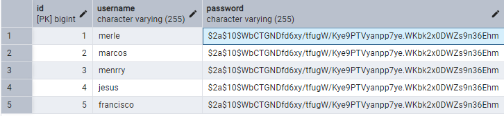
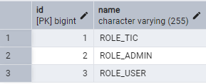
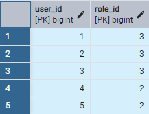
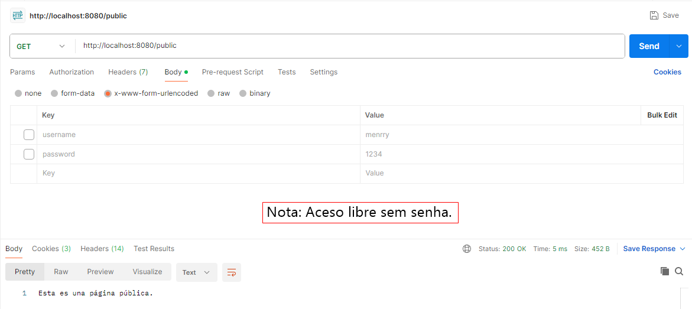
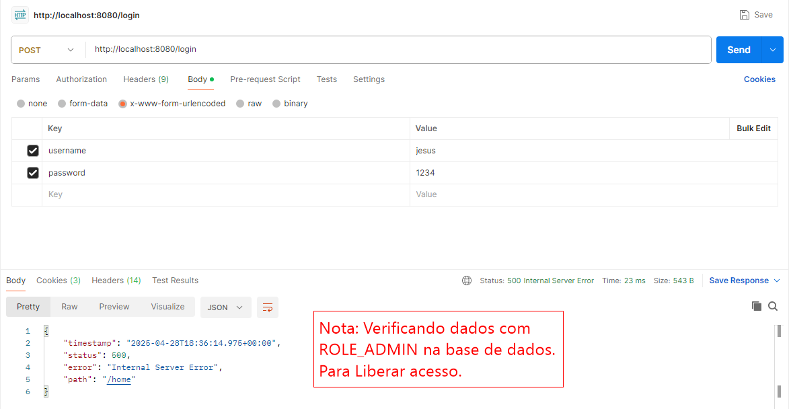
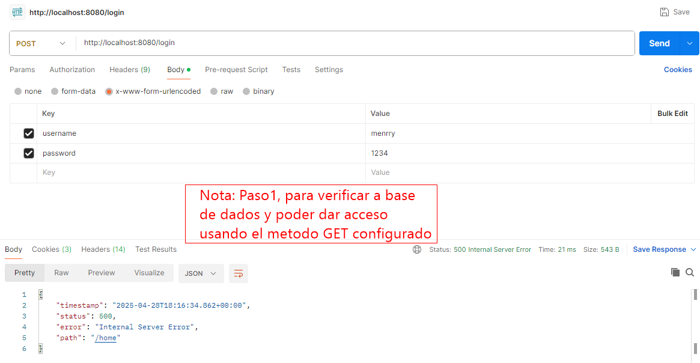
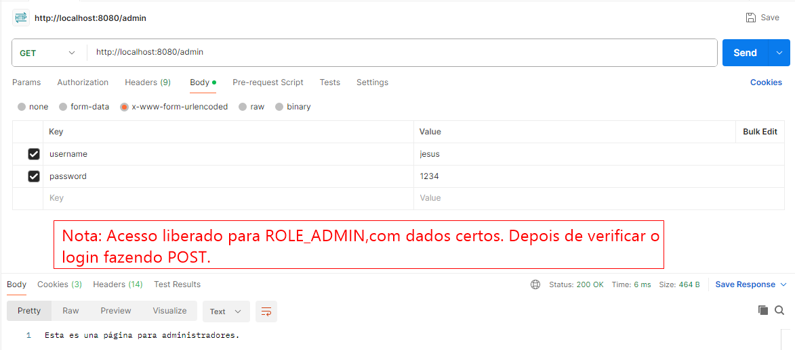
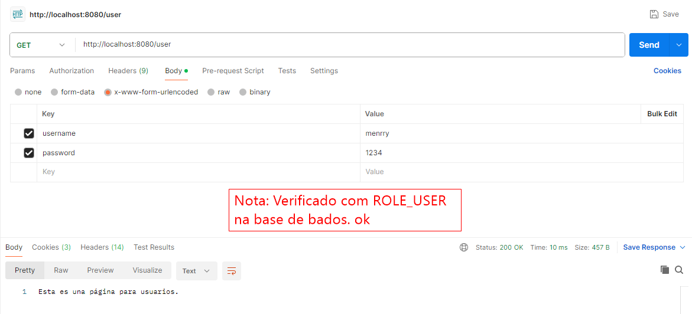
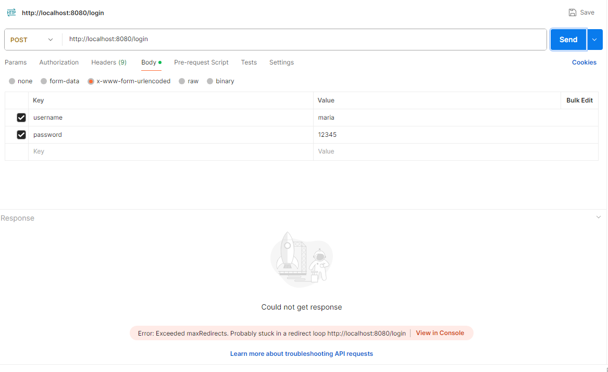
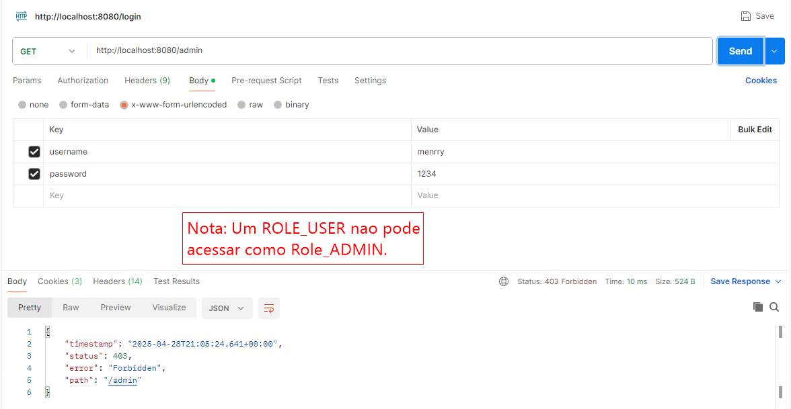

# Interface Spring Boot Security JWT Json Web Token usando Java 21 com Postman e PostgreSQL17.

## Table Users

## Table Roles

## Table Users- Roles

# Para usar la cookie de sesión en las subsiguientes peticiones en Postman y así identificar al usuario autenticado, sigue estos pasos:

## Paso 1: 
Asegúrate de que Postman esté configurado para guardar cookies automáticamente.

Por defecto, Postman debería guardar las cookies recibidas del servidor y enviarlas automáticamente en las peticiones posteriores al mismo dominio. Sin embargo, 
es bueno verificar esta configuración:

Abre la configuración de Postman: Ve a Postman > Settings (o File > Settings en algunas versiones).
Selecciona la pestaña "General".
Busca la sección "Cookies".
Asegúrate de que la opción "Automatically send cookies" esté habilitada (marcada). Si no lo está, actívala.
Cierra la ventana de configuración.

## Paso 2: Realiza la petición de login exitosa.

Sigue los pasos que mencionamos anteriormente para enviar una petición POST al endpoint de login de tu aplicación con el username y la contraseña correctos en el body (x-www-form-urlencoded).
Si el login es exitoso, el servidor responderá con un código de estado 302 Found (redirección) y establecerá una o más cookies en la cabecera Set-Cookie de la respuesta. Una de estas cookies 
será la cookie de sesión (por ejemplo, JSESSIONID en Tomcat).

Postman debería guardar automáticamente esta cookie. Puedes verificar esto de la siguiente manera:
Después de recibir la respuesta de login, haz clic en la pestaña "Cookies" justo debajo de la barra de la URL en Postman.
Deberías ver la cookie de sesión listada para el dominio de tu aplicación.

## Paso 3: Realiza las subsiguientes peticiones a los recursos protegidos.

Crea una nueva petición en Postman para el recurso protegido al que quieres acceder (por ejemplo, una petición GET a http://localhost:8080/admin o http://localhost:8080/user).
Asegúrate de que la URL de la petición coincida con el dominio para el que se estableció la cookie de sesión.
No necesitas agregar manualmente la cookie en las cabeceras. Postman debería enviar automáticamente las cookies relevantes (incluida la cookie de sesión) que guardó del servidor durante el login.
Haz clic en "Send" para enviar la petición.
Interpretación de la Respuesta:

Acceso Permitido (Código 200 OK): Si la cookie de sesión es válida y el usuario autenticado tiene los roles necesarios, el servidor debería responder con el recurso solicitado.

Acceso Denegado (Código 403 Forbidden): Si la cookie es válida pero el usuario no tiene los roles requeridos, recibirás un error de acceso denegado.
No Autenticado (Redirección a Login - Código 302 o 401 Unauthorized): Si la cookie de sesión no se envió (por alguna razón) o ha expirado, el servidor te redirigirá de nuevo 
a la página de login o devolverá un error de no autenticado.

